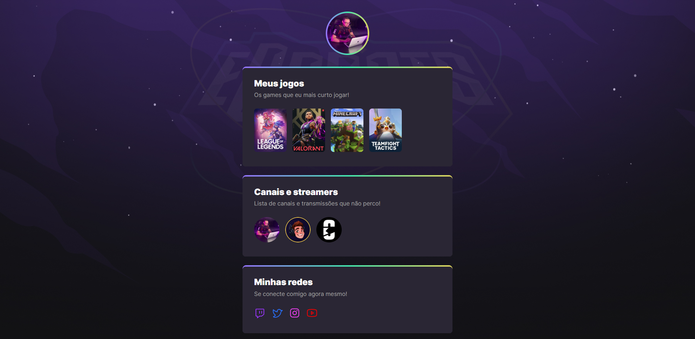

🚀; NLW eSports - Trilha Explorer

>Projeto construído no evento Next Level Week da Rocketseat.

[🔗 Clique no link para acessar o conteúdo] (https://alexandreagra.github.io/nlw-esports-explorer/)

Nesse projeto, aprendi outras formas de aplicar meus conhecimentos em HTML e CSS, especialmente, diferentes maneiras de se utilizar animações e organização/estruturação de código. Meus agradecimentos à Rocketseat e ao Mayk Brito, que comandou o projeto do início ao fim. 

## 🚀; Tecnologias utilizadas

- HTML
- CSS
- Git e Github

## 🚀; Contato

alexandreagradev@gmail.com

Todo e qualquer feedback será bem vindo, minha intenção é evoluir a cada dia, com muito estudo e dedicação. Obrigado &#x1F49C;